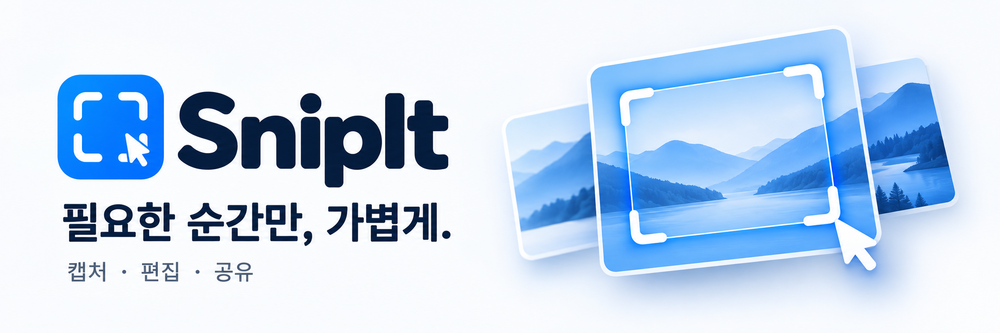

<p align="center">
  
</p>

# Snipit

<p>가볍고 포터블한 Windows 화면 캡쳐 도구</p>


## 기능

### 화면 캡쳐
- **전체 화면 캡쳐** - `PrintScreen` (커스터마이징 가능)
- **활성 창 캡쳐** - `Alt + PrintScreen` (커스터마이징 가능)
- **영역 선택 캡쳐** - `Ctrl + Shift + C` (커스터마이징 가능)
- **GIF 녹화** - `Ctrl + Shift + G` (15/30/60fps 설정 가능)
- **사일런트 모드** - 편집창 없이 바로 클립보드에 복사 (E키로 편집기 열기)
- 다중 모니터 지원
- 커서 포함 옵션
- 캡처 화면 어둡기 조절 (0~100%)
- 확대경 위치 설정 (8가지 옵션)

### 이미지 편집기
- 펜/자유 그리기
- 화살표
- 직선
- 사각형
- 원/타원
- 텍스트 삽입
- 하이라이트 (형광펜)
- 모자이크/블러 처리
- 자르기
- 실행 취소/다시 실행
- **도구별 단축키 커스터마이징** (설정에서 변경 가능)
- 초기 줌 설정 (창에 맞춤 / 100% 원본)

### 저장 및 공유
- PNG, JPG, BMP, GIF 형식 지원
- 클립보드 복사
- 파일 저장

### 시스템 트레이
- 최소화 시 시스템 트레이로 이동
- 트레이 아이콘에서 빠른 캡쳐 접근
- 글로벌 단축키 지원
- 사일런트 모드 토스트 알림

## 요구 사항

- Windows 10/11 (Windows 11 권장 - 라운드 코너, Mica 효과 지원)
- .NET 9 Runtime (Self-contained 버전은 불필요)

## 빌드 방법

### 필수 조건
- [.NET 9 SDK](https://dotnet.microsoft.com/download/dotnet/9.0) 설치

### 빌드
```bash
# PowerShell
.\build.ps1

# 또는 Command Prompt
build.bat
```

### 수동 빌드
```bash
cd src

# 개발용 빌드
dotnet build

# 포터블 EXE 생성
dotnet publish -c Release -r win-x64 --self-contained true -p:PublishSingleFile=true
```

빌드 결과물: `Publish/SnipIt.exe`

## 단축키

### 글로벌 (어디서든) - 설정에서 커스터마이징 가능
| 동작 | 기본 단축키 |
|------|--------|
| 전체 화면 캡쳐 | `PrintScreen` |
| 활성 창 캡쳐 | `Alt + PrintScreen` |
| 영역 선택 캡쳐 | `Ctrl + Shift + C` |
| GIF 녹화 | `Ctrl + Shift + G` |

### 편집기 - 파일/편집
| 동작 | 단축키 |
|------|--------|
| 저장 | `Ctrl + S` |
| 클립보드 복사 | `Ctrl + C` |
| 실행 취소 | `Ctrl + Z` |
| 다시 실행 | `Ctrl + Y` |
| 줌 인/아웃 | `Ctrl + 마우스휠` |

### 편집기 - 도구 선택 (설정에서 커스터마이징 가능)
| 도구 | 기본 단축키 |
|------|--------|
| 선택 | `V` |
| 펜 | `P` |
| 화살표 | `A` |
| 직선 | `L` |
| 사각형 | `R` |
| 타원 | `E` |
| 텍스트 | `T` |
| 형광펜 | `H` |
| 모자이크 | `M` |
| 자르기 | `C` |
| 취소/선택 해제 | `Esc` |

## 프로젝트 구조

```
WinCapture/
├── src/
│   ├── App.xaml              # 앱 진입점
│   ├── Views/
│   │   ├── MainWindow.xaml   # 메인 윈도우
│   │   ├── CaptureOverlay.xaml # 영역 선택 오버레이
│   │   ├── EditorWindow.xaml # 이미지 편집기
│   │   └── SettingsWindow.xaml # 설정 창
│   ├── ViewModels/
│   │   └── HistoryItemViewModel.cs # MVVM 뷰모델
│   ├── Services/
│   │   ├── ScreenCaptureService.cs # 화면 캡쳐 로직
│   │   ├── CaptureHistoryService.cs # 캡쳐 히스토리 관리
│   │   ├── GifRecorderService.cs # GIF 녹화 서비스
│   │   ├── HotkeyService.cs  # 글로벌 단축키
│   │   ├── LocalizationService.cs # 다국어 지원
│   │   └── TrayIconService.cs # 시스템 트레이
│   ├── Utils/
│   │   ├── NativeMethods.cs  # Win32 API + Windows 11 DWM
│   │   └── ImageProcessingHelper.cs # 고성능 이미지 처리
│   └── Models/
│       ├── AppSettingsConfig.cs # 앱 설정
│       └── HotkeyConfig.cs   # 단축키 설정
├── build.bat                 # Windows 빌드 스크립트
├── build.ps1                 # PowerShell 빌드 스크립트
├── LICENSE                   # MIT 라이선스
├── .gitignore
└── README.md
```

## 기술 스택

- .NET 9 / C# 13
- WPF (Windows Presentation Foundation)
- CommunityToolkit.Mvvm (MVVM 패턴)
- AnimatedGif (GIF 녹화)
- Windows 11 DWM API (라운드 코너, Mica 효과)

## 보안

### VirusTotal 검증
- [v2.3.0 검증 결과](https://www.virustotal.com/gui/file/8bbbb062903888585313d36a3af1c7aca8b6fac4562cf7763b232c7b79582e05)
- 1/71 탐지 (Zillya 오탐 - Self-contained .NET 앱 특성)
- 소스코드 100% 공개 - 직접 빌드 가능

### 왜 일부 백신에서 오탐이 발생하나요?
Self-contained .NET 앱은 다음 특성으로 인해 일부 백신에서 오탐될 수 있습니다:
- 대용량 단일 실행파일 (런타임 포함)
- 화면 캡쳐, 글로벌 핫키, 키보드 훅 등 시스템 API 사용
- 클립보드 접근

이는 악성코드와 무관하며, 70개 이상의 주요 백신에서 정상 판정을 받았습니다.

## 기여하기

1. Fork 후 새 브랜치 생성
2. 변경사항 커밋
3. Pull Request 생성

버그 리포트나 기능 제안은 Issues를 이용해주세요.

## 라이선스

MIT License - 자유롭게 사용, 수정, 배포 가능

## 온라인 업데이트 (v2.6.0)

- 메인 화면 또는 트레이의 **업데이트**에서 직접 확인·다운로드·설치할 수 있습니다.
- 설정의 **새 버전 자동 확인**은 기본 활성화되어 있으며 시작 8초 후와 6시간마다 GitHub 정식 릴리즈를 확인합니다.
- **업데이트 자동 다운로드**는 선택 사항이며 기본 비활성화입니다. 설치와 재시작은 항상 사용자가 선택합니다.
- 편집·설정 창을 닫고 캡처/녹화와 GIF 저장이 완료되어야 설치할 수 있습니다.
- 최초 v2.6.0 설치까지는 실행 파일을 직접 교체해야 합니다. 이후 버전부터 앱 내 업데이트가 가능합니다.

### 배포 요구 사항

GitHub `svrforum/snipit`의 정식 릴리즈에 `SnipIt.exe`와 `SHA256SUMS.txt`를 모두 첨부하고
버전 태그를 `v2.6.0` 형식으로 지정합니다. 베타/초안/현재보다 낮은 버전은 설치하지 않습니다.
체크섬 파일은 `64자리 SHA-256  SnipIt.exe` 형식입니다. GitHub 자산 digest가 제공되면 함께 대조합니다.
체크섬은 다운로드 무결성 검증이며 별도의 코드 서명 인증서를 대신하지는 않습니다.

설치는 self-contained 단일 EXE 배포본에서 지원됩니다. 일반 개발 빌드는 확인·다운로드까지만 지원합니다.
프로그램 폴더 쓰기 권한이 없으면 종료 전에 설치를 중단하며 관리자 권한을 자동 요청하지 않습니다.
업데이트 도우미는 원래 프로세스 종료를 기다리고 파일을 교체하며, 이전 파일은
`SnipIt.exe.previous-<고유값>`으로 보존합니다. 교체/재실행 실패 시 이전 파일로 복구를 시도합니다.
복구 파일을 직접 사용할 때는 실행 파일이 종료된 상태에서 `.exe` 파일명으로 복원하세요.
다운로드 캐시는 재시작 후 재사용하고, 7일이 지난 업데이트 캐시는 자동 정리합니다.

## 두 가지 버전과 다운로드

| 항목 | 기존 WPF | WinUI |
|---|---|---|
| 다운로드 | [SnipIt.exe](https://github.com/svrforum/snipit/releases/latest/download/SnipIt.exe) | [SnipIt-WinUI.exe](https://github.com/svrforum/snipit/releases/latest/download/SnipIt-WinUI.exe) |
| 선택 기준 | 기존 기능과 사용 흐름을 선호할 때 | 새 UI와 편집 흐름을 사용하고 싶을 때 |
| 화면 | 기존 WPF 화면 | 컴팩트 WinUI 메인, 도구별 커서 |
| 편집 이력 | 기존 WPF 동작 유지 | 편집·실행 취소 결과를 같은 이력 항목에 자동 반영 |
| 종료 | 기존 종료 흐름 | 트레이 종료 시 편집본 이력 저장 후 편집기 함께 종료 |
| 형광펜 | 자유 곡선 + 수평 보정, Shift 고정 | 자유 곡선 + 수평 보정, Shift 고정 |
| 업데이트 | WPF 실행 파일만 선택 | WinUI 실행 파일만 선택 |
| 검증 범위 | 기존 회귀 검사 | 코어/통합 검사, 혼합 DPI 실기기·장시간 성능 비교는 추가 검증 중 |

두 파일은 x64 포터블이며 .NET을 별도로 설치하지 않아도 됩니다. 기본 설정/이력 저장 위치를 공유하므로 동시 실행보다는 한 버전씩 사용하세요. UI 프레임워크만으로 CPU/메모리가 항상 개선되는 것은 아닙니다.

**이전 WinUI 프리뷰 사용자는 이번 WinUI 실행 파일을 직접 다운로드해 교체하세요.** 구형 프리뷰의 업데이트 로직은 기존 WPF 자산을 선택할 수 있습니다. 새 버전부터는 WPF와 WinUI 업데이트 파일 및 WinUI 업데이트 캐시를 구분합니다. 자동 확인/다운로드는 설정을 따르며 설치는 앱의 업데이트 후 재시작으로 진행합니다.

## 자동 빌드와 배포

- main 푸시/PR: 편집 코어와 WPF 회귀 검사 → 두 버전 빌드 → Actions 아티팩트 생성.
- 릴리즈: 두 csproj의 Version을 동일하게 올리고 `docs/releases/vX.Y.Z.md`를 작성한 뒤 해당 커밋에 `vX.Y.Z` 태그를 푸시합니다.
- 태그 빌드 성공 시 GitHub Release에 두 EXE와 `SHA256SUMS.txt`를 함께 올리고 공개합니다. 실패하면 공개 단계를 진행하지 않습니다.
- 로컬 빌드: `./build-dual.ps1 -Output ./dist-dual`.

상세 검증 범위는 [WinUI 전환 기록](docs/winui-migration-status.md)을 참고하세요.
